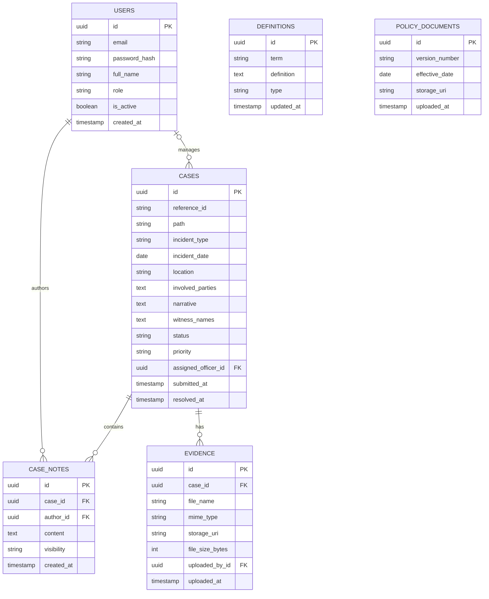

# UG Gender Policy CMS — Database Schema & Relationships

This document outlines the relational database schema required to support the API endpoints and the operational data flow of the UG Gender Policy Case Management System. A PostgreSQL database is recommended to enforce strict constraints.

## Entity Relationship Diagram (ERD)

---

## Data Dictionary

### 1. `users` Table
Stores authentication and profile data for EOB Secretariat staff and assigned Investigators.
- **`role`**: Enforces RBAC. `ADMIN` has global oversight, `OFFICER` has access only to assigned cases.
- **`is_active`**: Used for soft-deleting or revoking access for offboarded staff to preserve historical assignment data on closed cases.

### 2. `cases` Table (The Core Record)
Stores the primary details of a grievance submitted by the university community.
- **`reference_id`**: A unique, pseudo-anonymous string (e.g., `#GBC-24-0812`) returned to the user upon submission.
- **`incident_type`**: Restricted by an Enum that perfectly maps to the 9 official policy offences (e.g., `sexist_remarks`, `promotion_denial`, `gbv`).
- **`assigned_officer_id`**: Foreign Key to the `users` table. Setting this value starts the 7-day notification SLA.
- **`submitted_at`**: Timestamp used to calculate the 21-day adjudication deadline.

### 3. `case_notes` Table
Acts as an audit trail and investigation log for an active case.
- **`visibility`**: Determines if the note is purely for the internal officer (`internal`) or if it should be included in the dossier sent to the Adjudication Panel (`panel`).

### 4. `evidence` Table
Manages all uploaded media and documents related to a case.
- **`storage_uri`**: A secure URI pointing to the actual file in cloud blob storage (e.g., AWS S3).
- **`uploaded_by_id`**: Tracks provenance. If null, the evidence was uploaded by the anonymous complainant during the initial public submission. If populated, it was uploaded by an investigating officer.

### 5. `definitions` Table
Centralized registry for the policy terminology, served to the public `/definitions` route.
- Allows EOB Administrators to update definitions dynamically without requiring frontend code changes.

### 6. `policy_documents` Table
Version control for the official PDF policy documents and tracking their effective dates.

---

## Security & Constraints

1. **Foreign Key Integrity**: `ON DELETE RESTRICT` should be applied to `users` -> `cases` to prevent deleting an officer who has handled a case.
2. **Encryption at Rest**: Ensure the entire database is encrypted at rest. Furthermore, the `narrative` and `involved_parties` fields may benefit from application-level encryption depending on strict university data governance.
3. **Immutability**: Records in the `evidence` and `case_notes` tables should generally be treated as append-only/immutable to maintain a strict legal chain of custody for investigations.
