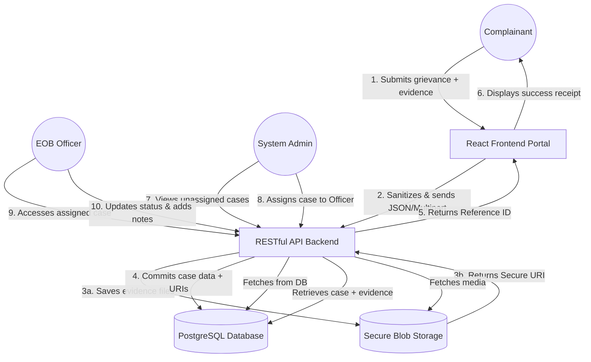
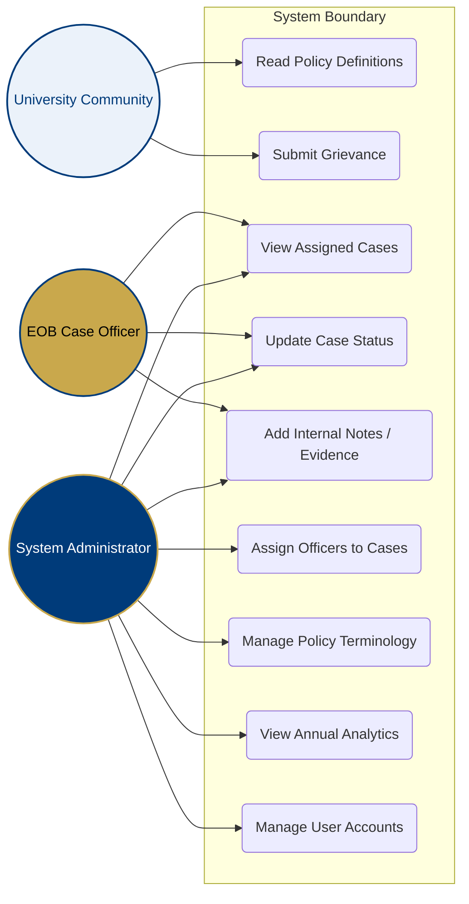

# UG Gender Policy CMS — Architecture Diagrams

This document contains the visual blueprints for the system's architecture. 

*Note: The **Entity-Relationship Diagram (ERD)** is located in the [`DB_SCHEMA.md`](./DB_SCHEMA.md) file.*

---

## 1. Data Flow Diagram (DFD)
**Purpose**: Illustrates how information moves through the system from the initial user input to permanent storage and administrative retrieval.



---

## 2. Sequence Diagram: Case Submission & 7-Day SLA
**Purpose**: Shows the step-by-step chronological interactions between the actors and the system, highlighting the critical 7-day notification SLA.

```mermaid
sequenceDiagram
    participant C as Complainant
    participant Sys as System
    participant SA as System Admin
    participant Off as EOB Case Officer

    C->>Sys: Submit Formal Complaint
    activate Sys
    Sys->>Sys: Generate Reference ID & Save
    Sys-->>C: Return Success (Ref ID + 7-Day SLA)
    deactivate Sys
    
    Sys->>SA: Dashboard Alert - New Initial Review
    
    SA->>Sys: Review Case details
    activate Sys
    SA->>Sys: Assign EOB Case Officer
    Sys->>Sys: Start 21-Day Adjudication Timer
    Sys-->>Off: Notification - New Case Assigned
    deactivate Sys
    
    Note over Off, C: Must happen within 7 working days
    Off->>C: Formal Contact & Acknowledgement
    
    Off->>Sys: Update Case Status to Investigation
    Sys-->>Sys: Log Timestamp (Audit Trail)
```

---

## 3. Use Case Diagram
**Purpose**: Defines the various actors in the system and the specific features (use cases) they are permitted to interact with based on their roles.


