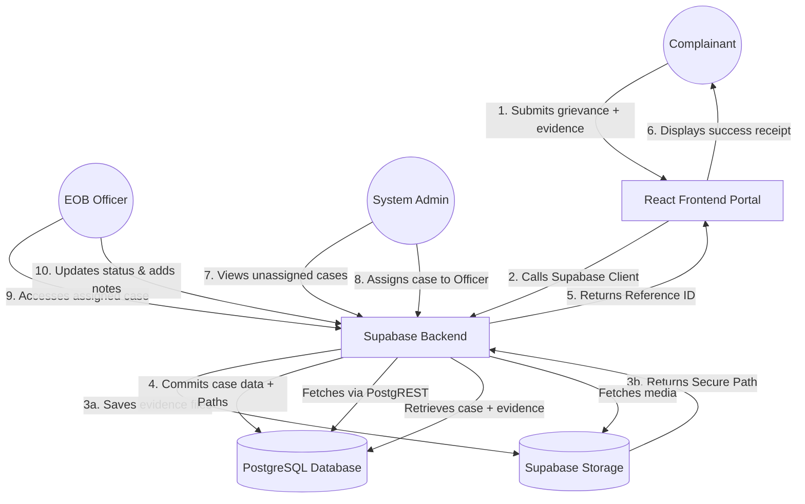
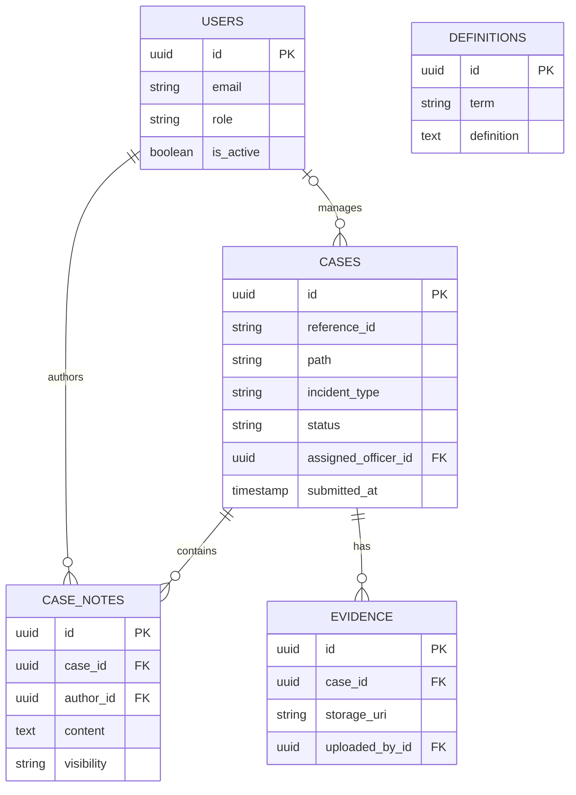

# Master Documentation: UG Gender Policy Case Management System

## 1. Executive Summary & Project Scope

The University of Ghana (UG) Gender Policy Case Management System is an institutional-grade, interactive reference website and secure administrative portal. It is built to digitize the UG Gender Policy (2023) and facilitate the secure reporting, tracking, and resolution of gender-based grievances.

### In-Scope
- **Interactive Policy Reference**: Digitizing the policy into searchable, navigable tabs.
- **Secure Incident Reporting**: A multi-step reporting wizard for formal/informal complaints with evidence uploads.
- **Administrative Case Management**: A secure EOB dashboard to track the 21-day adjudication window.
- **Policy & Analytics Management**: Tools to manage definitions and aggregate annual metrics.

### Out-of-Scope
- External Legal Adjudication (e.g., Police, Courts).
- Automated HR/SIS database integrations.
- In-App Real-Time Chat (communication happens offline/via official email).

---

## 2. User Profiles & User Stories

### 2.1 The University Community (Complainants)
*Students, academic faculty, administrative staff, and interns.*
- **US-01**: As a student, I want to easily search policy definitions so I understand my rights under the Gender Policy.
- **US-02**: As a complainant, I want to report an incident through a secure, guided form so my privacy is protected.
- **US-03**: As a complainant, I want to upload screenshots and audio evidence so the EOB has proof of the grievance.
- **US-04**: As a complainant, I want to receive an anonymous Reference ID so I can safely track my case.

### 2.2 EOB Case Officers (Investigators)
*Dedicated personnel appointed by the EOB Secretariat.*
- **US-05**: As an investigating officer, I want to be notified when a new case is assigned to me so I can meet the 7-day contact SLA.
- **US-06**: As an investigating officer, I want to add internal notes to a case file so I can keep a secure audit trail of my interviews.
- **US-07**: As an investigating officer, I want to see a visual timeline on my cases so I don't breach the 21-day adjudication deadline.

### 2.3 System Administrators (EOB Secretariat)
*High-level administrative staff overseeing policy implementation.*
- **US-08**: As a system admin, I want to view a dashboard of all active cases so I can assign them to available officers.
- **US-09**: As a system admin, I want to update policy definitions directly from the dashboard so the public portal remains accurate without developer intervention.
- **US-10**: As a system admin, I want to generate annual analytics so I can easily compile the Vice-Chancellor's Gender Equality Annual Report.

---

## 3. Core Features & UI Walkthrough

### 3.1 Public Portal
**Interactive Policy Reference & Definitions**
Users can navigate the official policy principles and search through the 33 official terms in real-time.
> `[insert screenshot of the Public Definitions/Overview Page]`

**Secure Incident Reporting Wizard**
A 5-step form (Path, Details, Narrative, Evidence, Review) guiding users to submit grievances securely.
> `[insert screenshot of the Report Incident Wizard]`

**Submission Receipt**
Confirmation screen providing the Reference ID and the 7-day EOB contact guarantee.
> `[insert screenshot of the Submission Confirmation Screen]`

### 3.2 Administrative Dashboard
**Operational Home Dashboard**
High-level live metrics tracking active filings, open enquiries, and panel hearings.
> `[insert screenshot of the Admin Dashboard metrics]`

**Case Management Registry**
Secure data grid with advanced filtering (by offence, type) and SLA timeline warning bars.
> `[insert screenshot of the Admin Cases Registry]`

**Policy Terminology Manager**
CRUD interface allowing administrators to update the public definition registry.
> `[insert screenshot of the Admin Definitions Manager]`

---

## 4. System Architecture & Data Flow

### Data Flow Diagram (DFD)
Illustrates how information moves from the complainant, through the API, into secure storage, and to the EOB administrators.



### End-to-End SLA Sequence Diagram
Highlights the critical 7-day notification SLA and 21-day adjudication timer.

```mermaid
sequenceDiagram
    participant C as Complainant
    participant Sys as System
    participant SA as System Admin
    participant Off as EOB Case Officer

    C->>Sys: Submit Formal Complaint
    activate Sys
    Sys->>Sys: Generate Reference ID & Save
    Sys-->>C: Return Success (Ref ID + 7-Day SLA)
    deactivate Sys
    
    Sys->>SA: Dashboard Alert - New Initial Review
    
    SA->>Sys: Review Case details
    activate Sys
    SA->>Sys: Assign EOB Case Officer
    Sys->>Sys: Start 21-Day Adjudication Timer
    Sys-->>Off: Notification - New Case Assigned
    deactivate Sys
    
    Note over Off, C: Must happen within 7 working days
    Off->>C: Formal Contact & Acknowledgement
    
    Off->>Sys: Update Case Status to Investigation
    Sys-->>Sys: Log Timestamp (Audit Trail)
```

---

## 5. Database Architecture

### Entity Relationship Diagram (ERD)



**Security Constraints**: 
- Strict Foreign Key integrity (`ON DELETE RESTRICT`) on Users.
- Encryption at rest for the PostgreSQL database and Evidence Blob Storage.
- Append-only immutability for `CASE_NOTES` and `EVIDENCE` to preserve legal chain of custody.

### Data Dictionary

#### 1. `users` Table
Stores authentication and profile data for EOB Secretariat staff and assigned Investigators.
- **`role`**: Enforces RBAC. `ADMIN` has global oversight, `OFFICER` has access only to assigned cases.
- **`is_active`**: Used for soft-deleting or revoking access for offboarded staff to preserve historical assignment data on closed cases.

#### 2. `cases` Table (The Core Record)
Stores the primary details of a grievance submitted by the university community.
- **`reference_id`**: A unique, pseudo-anonymous string (e.g., `#GBC-24-0812`) returned to the user upon submission.
- **`incident_type`**: Restricted by an Enum that perfectly maps to the 9 official policy offences (e.g., `sexist_remarks`, `promotion_denial`, `gbv`).
- **`assigned_officer_id`**: Foreign Key to the `users` table. Setting this value starts the 7-day notification SLA.
- **`submitted_at`**: Timestamp used to calculate the 21-day adjudication deadline.

#### 3. `case_notes` Table
Acts as an audit trail and investigation log for an active case.
- **`visibility`**: Determines if the note is purely for the internal officer (`internal`) or if it should be included in the dossier sent to the Adjudication Panel (`panel`).

#### 4. `evidence` Table
Manages all uploaded media and documents related to a case.
- **`storage_uri`**: A secure URI pointing to the actual file in cloud blob storage (e.g., AWS S3).
- **`uploaded_by_id`**: Tracks provenance. If null, the evidence was uploaded by the anonymous complainant during the initial public submission. If populated, it was uploaded by an investigating officer.

#### 5. `definitions` Table
Centralized registry for the policy terminology, served to the public `/definitions` route.
- Allows EOB Administrators to update definitions dynamically without requiring frontend code changes.

---

## 6. API Infrastructure (Supabase PostgREST)

The system utilizes the auto-generated **Supabase PostgREST API** to handle end-to-end data flow. All requests are handled via the Supabase JS SDK.

### 6.1 Public Content & Policy Reference
Endpoints serving the public-facing educational portals. No authentication required (RLS allows select).

| Entity | Action | Description | Query / Filter |
|---|---|---|---|
| `definitions` | `GET` | Retrieves all official policy terms and acronyms. | `.select()`, `.eq('type', ...)` |
| `offences` | `GET` | Retrieves the official policy offences. | - |

### 6.2 Complaint Intake & Reporting (Public)
Handles the ingestion of grievances.

| Entity | Action | Description | Payload |
|---|---|---|---|
| `cases` | `INSERT` | Submits a new formal or informal grievance. | `{ reference_id, path, incident_type, ... }` |
| `storage` | `UPLOAD` | Handles evidence uploads to the `evidence` bucket. | `multipart/form-data` |

### 6.3 Authentication & Authorization
Powered by **Supabase Auth**.

| Action | Description | Method |
|---|---|---|
| `signInWithPassword` | Authenticates staff and issues JWTs. | `auth.signIn()` |
| `getUser` | Retrieves the authenticated user's profile and RBAC role. | `auth.getUser()` |

### 6.4 Case Management (Admin & Officers)
Lifecycle management of cases. Governed by **PostgreSQL RLS Policies**.

| Entity | Action | Description | Access Level |
|---|---|---|---|
| `cases` | `SELECT` | Lists cases based on RLS. | Admin (All), Officer (Assigned) |
| `cases` | `UPDATE` | Updates status or priority. | Admin/Officer |
| `case_notes` | `INSERT` | Appends a new internal investigation note. | Officer |

### 6.5 Global Policy Management (Admin Only)
Endpoints for managing the underlying taxonomies of the policy. Requires `ADMIN` role.

| Method | Endpoint | Description | Payload |
|---|---|---|---|
| `POST` | `/api/v1/admin/definitions` | Creates a new policy term or acronym. | **Body**: `{ term, definition, type }` |
| `PUT` | `/api/v1/admin/definitions/:id` | Updates an existing definition. | **Body**: `{ term, definition }` |
| `DELETE`| `/api/v1/admin/definitions/:id` | Removes a definition from the registry. | - |

### 6.6 Reporting & Analytics (Admin Only)
Endpoints supporting the dashboard metrics and annual reporting requirements. Requires `ADMIN` role.

| Method | Endpoint | Description | Query Parameters |
|---|---|---|---|
| `GET` | `/api/v1/admin/analytics/dashboard` | Fetches real-time counts for active filings, open enquiries, and panel hearings. | - |
| `GET` | `/api/v1/admin/analytics/annual` | Fetches aggregated, anonymized metrics for the Gender Equality Annual Report. | `?academicYear=2024-2025` |

### 6.7 System & User Management (Admin Only)
Endpoints for managing EOB staff access. Requires `ADMIN` role.

| Method | Endpoint | Description | Payload |
|---|---|---|---|
| `GET` | `/api/v1/admin/users` | Lists all registered EOB Secretariat staff, Administrators, and Case Officers. | - |
| `POST` | `/api/v1/admin/users` | Provisions a new account for an EOB staff member. | **Body**: `{ name, email, role, department }` |
| `PUT` | `/api/v1/admin/users/:id` | Updates user details or role. | **Body**: `{ name, role, isActive }` |
